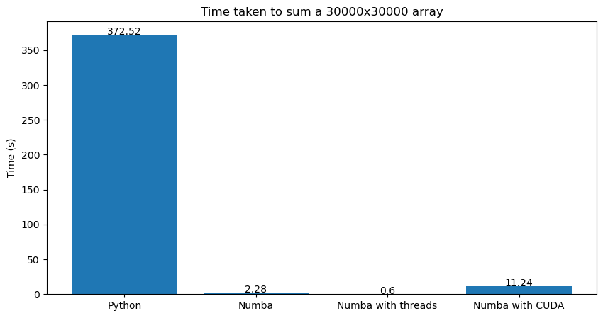

# Boost Your Python Code with Numba
I am doing my master's thesis which is about developing a simulator of colon deformation. The simulator is written in Python and uses the finite element method to solve the mechanical problem. As the simulator is developed in Python and the colon model is fairly detailed, the simulation was simply unfeasible to run in a reasonable time.

I was looking for ways to speed up the simulation and I found Numba. Numba is a just-in-time (JIT) compiler for Python that translates Python functions to optimized machine code at runtime using the industry-standard LLVM compiler library. It is designed to be used with NumPy arrays and functions, and it can significantly speed up numerical computations in Python. In my opinion, the most important feature of Numba is that it allows you to write Python code that is as fast as C code with minimal effort.

## Quick Example
```python
from numba import njit, prange
import numpy as np
import timeit
from matplotlib import pyplot as plt

def sum2d_python(arr):
    M, N = arr.shape
    result = 0.0
    for i in range(M):
        for j in range(N):
            result += arr[i,j]
    return result

@njit()
def sum2d(arr):
    M, N = arr.shape
    result = 0.0
    for i in range(M):
        for j in range(N):
            result += arr[i,j]
    return result

@njit(parallel=True, nogil=True)
def sum2d_thread(arr):
    M, N = arr.shape
    result = 0.0
    for i in prange(M):
        for j in prange(N):
            result += arr[i,j]
    return result

# CUDA
@cuda.jit
def sum2d_cuda_kernel(arr, result):
    X, Y = cuda.grid(2)
    if X < arr.shape[0] and Y < arr.shape[1]:
        cuda.atomic.add(result, 0, arr[X, Y])

def sum2d_cuda(arr):
    result = np.zeros(1, dtype=np.float64)
    d_arr = cuda.to_device(arr)
    d_result = cuda.to_device(result)
    threadsperblock = (32, 32)
    blockspergrid_x = (arr.shape[0] + threadsperblock[0] - 1) // threadsperblock[0]
    blockspergrid_y = (arr.shape[1] + threadsperblock[1] - 1) // threadsperblock[1]
    blockspergrid = (blockspergrid_x, blockspergrid_y)
    sum2d_cuda_kernel[blockspergrid, threadsperblock](d_arr, d_result)
    cuda.synchronize()
    result = d_result.copy_to_host()
    return result

big_array = np.random.rand(20000, 20000)

py_time = timeit.timeit(lambda: sum2d_python(big_array), number=5)
numba_time = timeit.timeit(lambda: sum2d(big_array), number=5)
numba_thread_time = timeit.timeit(lambda: sum2d_thread(big_array), number=5)
numba_cuda_time = timeit.timeit(lambda: sum2d_cuda(big_array), number=5)

# Plotting
x = ['Python', 'Numba', 'Numba with threads', 'Numba with CUDA']
y = [py_time, numba_time, numba_thread_time, numba_cuda_time]

plt.bar(x, y)
plt.ylabel('Time (s)')

# show number on top of bar
for i in range(len(x)):
    plt.text(i, y[i], round(y[i], 2), ha='center')

# show title
plt.title('Time taken to sum a 30000x30000 array')

plt.show()
```



We can see a significant speedup when using Numba. The parallel version is even faster than the non-parallel version.