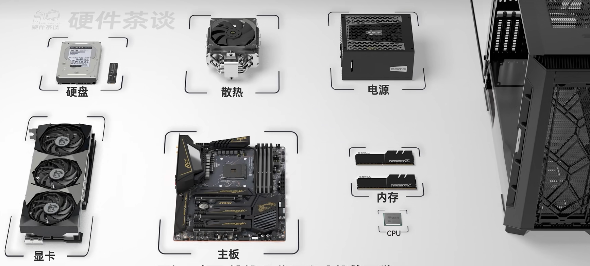
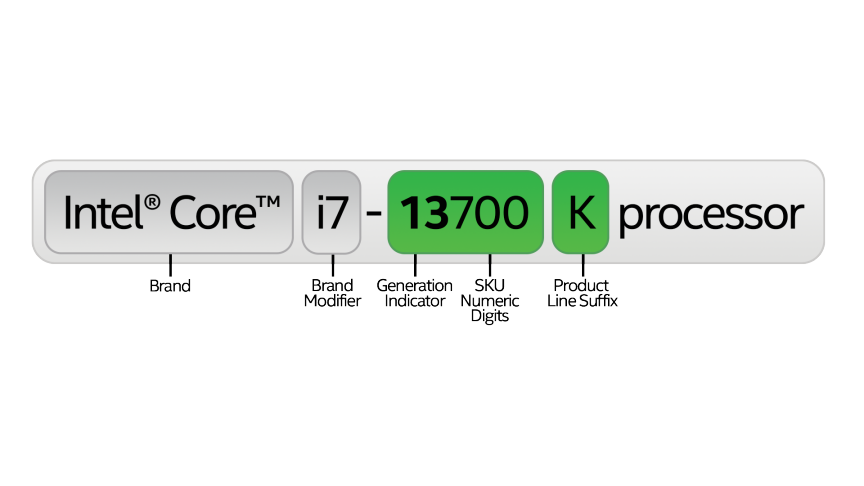
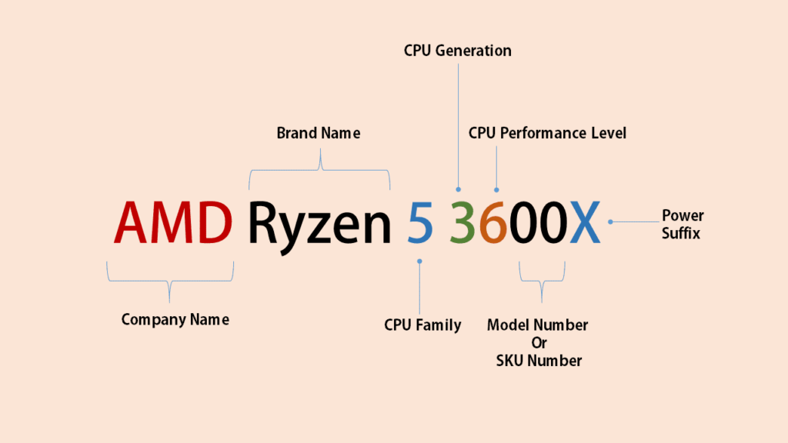
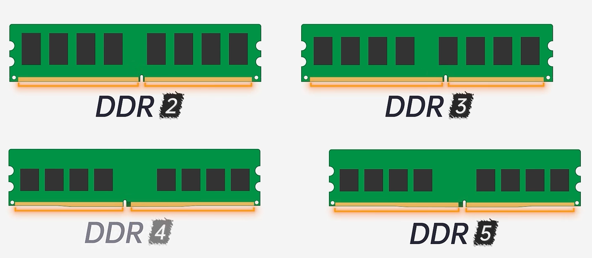
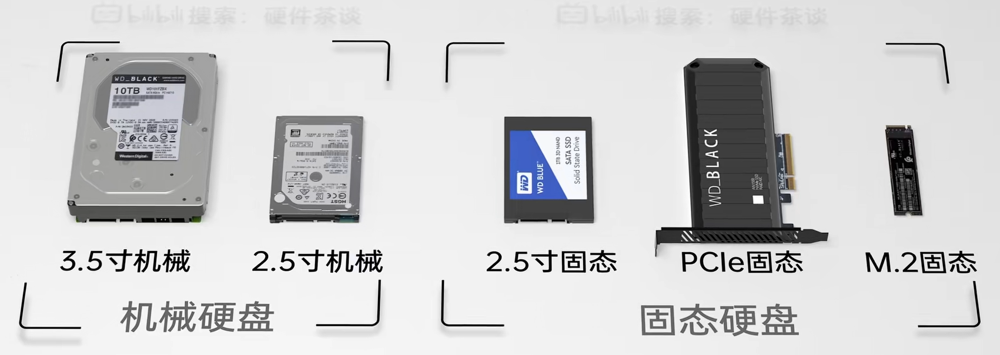
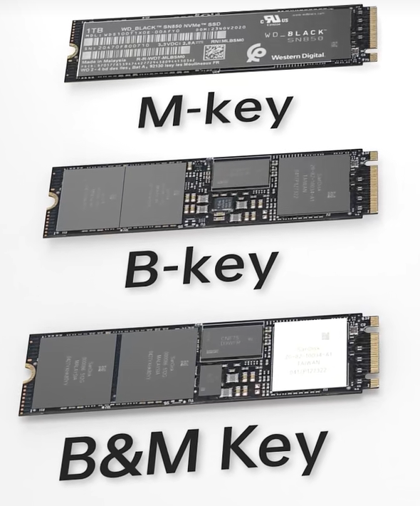
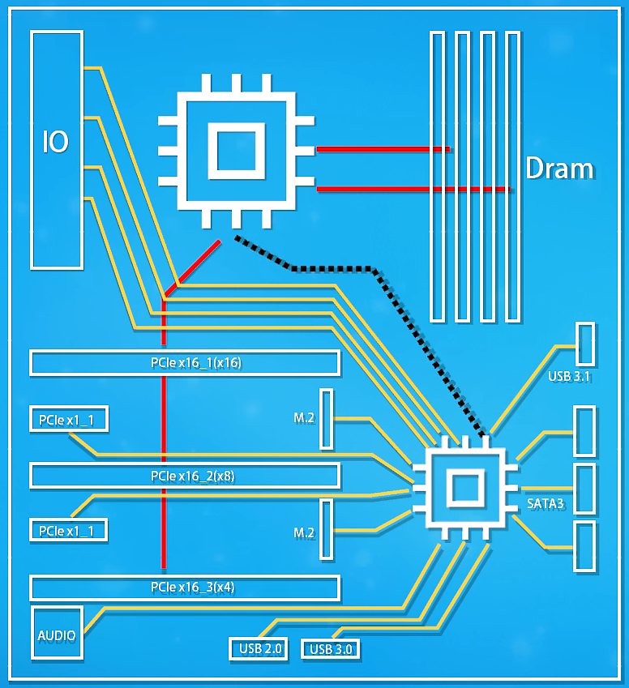
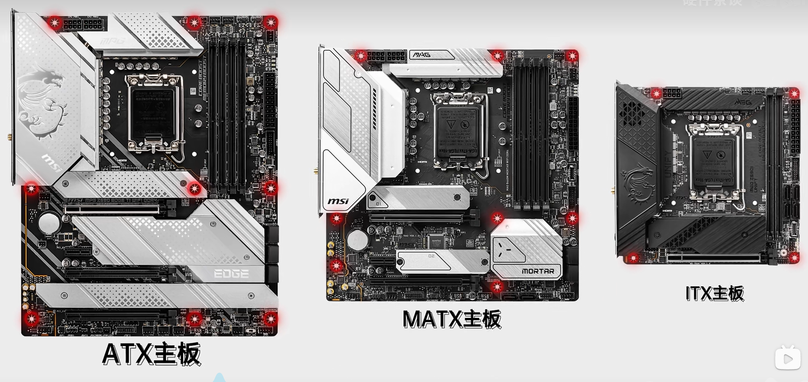

# Build My First PC
As a computer science student, I have been using laptops for years. However, I have never built a PC before. I also need a powerful PC for my master thesis. So I decided to build my first PC. I will document the process here. 

## Study the basics
I have tried several times to learn about PC hardware, but I always gave up because I was not fully committed to building a PC. This time, I am fully committed and want to do it right. So I started with the basics. I first started watching this [video](https://www.bilibili.com/video/BV1BG4y137mG/?share_source=copy_web&vd_source=909d7ffd31e6a012de164ae0db755009)

Just the desktop itself it has 8 main components:
- Case
- Motherboard
- CPU
- RAM
- GPU
- Storage
- Power Supply
- Cooling

### CPU
Do I have to explain what a CPU is? I don't think so. But I will explain some basic concepts.

#### Intel vs AMD CPU
Intel and AMD are the two major CPU manufacturers. Intel has been dominating the market for years. However, AMD has been catching up in recent years. AMD's Ryzen series is very competitive with Intel's Core series. One thing to note is that the motherboard for Intel CPUs is not compatible with AMD CPUs and different generations of Intel CPUs are not compatible with each other. The same is true for AMD CPUs. So you have to choose between Intel and AMD first before choosing a motherboard.

##### The naming conventions
These CPUs have different naming conventions. Intel uses i3, i5, i7, i9 to name their CPUs. AMD uses Ryzen 3, Ryzen 5, Ryzen 7, Ryzen 9 to name their CPUs. 

For example, i9-10900K is an Intel CPU. i9 means it is the top of the line CPU. The first 2 digits of 10900 means it is the 10th generation of the i9 series. For the last 3 digits of 10xxx, the bigger the number, the better the performance. K means it is unlocked, which means it can be overclocked. Here is a list of letters that Intel uses to name their CPUs.

<table>
    <thead>
    <tr>
        <th>Form/Function Type/Segment</th>
        <th>Suffix</th>
        <th>Optimized/Designed For</th>
    </tr>
    </thead>
    <tbody>
    <tr>
        <td rowspan="5">Desktop</td>
        <td>K</td>
        <td>High performance, unlocked (can overclock)</td>
    </tr>
    <tr>
        <td>F</td>
        <td>Requires discrete graphics (No integrated graphics)</td>
    </tr>
    <tr>
        <td>S</td>
        <td>Special edition</td>
    </tr>
    <tr>
        <td>T</td>
        <td>Power-optimized lifestyle (Low power)</td>
    </tr>
    <tr>
        <td>X/XE</td>
        <td>Highest performance, unlocked</td>
    </tr>
    <tr>
        <td rowspan="7">Mobile (Laptop2, 2 in 1)</td>
        <td>HX</td>
        <td>Highest performance, all SKUs unlocked</td>
    </tr>
    <tr>
        <td>HK</td>
        <td>High performance, unlocked</td>
    </tr>
    <tr>
        <td>H</td>
        <td>High performance</td>
    </tr>
    <tr>
        <td>P</td>
        <td>Performance for thin & light</td>
    </tr>
    <tr>
        <td>U</td>
        <td>Power efficient</td>
    </tr>
    <tr>
        <td>Y</td>
        <td>Extremely low-power efficient</td>
    </tr>
    <tr>
        <td>G1-G7</td>
        <td>Graphics level (processors with newer integrated graphics technology)</td>
    </tr>
    <tr>
        <td rowspan="5">Embedded</td>
        <td>E</td>
        <td>Embedded</td>
    </tr>
    <tr>
        <td>UE</td>
        <td>Power efficient</td>
    </tr>
    <tr>
        <td>HE</td>
        <td>High performance</td>
    </tr>
    <tr>
        <td>UL</td>
        <td>Power efficient, in LGA package</td>
    </tr>
    <tr>
        <td>HL</td>
        <td>High performance, in LGA package</td>
    </tr>
    </tbody>
</table>

AMD's naming convention is similar. For example, Ryzen 9 5700G is an AMD CPU. Ryzen 9 means it is the top of the line CPU. The first digit of 5700 means it is the 5th generation of the Ryzen 9 series. For the last 3 digits of 5xxx, the bigger the number, the better the performance. G means it has integrated graphics. Here is a list of letters that AMD uses to name their CPUs.

| Letter | Meaning |
| :-: | :-: |
| G | Integrated graphics |
| X | High performance |
| T | higher clock speeds |
| U | Ultra-low power |
| H | High performance mobile |
| none | desktop processors |

### RAM
The two types of the RAM are DDR4 and DDR5. They require different motherboards. It has 288 pins and it has a notch on the bottom to prevent it from being inserted incorrectly. It uses DIMM (Dual In-line Memory Module) slots on the motherboard. Normally, the motherboard has 2 or 4 DIMM slots. Make sure you install the RAM sticks in the right slots because they have different speeds. The motherboard manual will tell you which slots to use.

DDR stands for Double Data Rate. It means it can transfer data twice per clock cycle. Therefore, the effective clock speed is twice the actual clock speed. For example, DDR4-3200 means the actual clock speed is 1600 MHz and the effective clock speed is 3200 MHz.

#### Main Quality Metrics
- Capacity: The amount of data that can be stored in the RAM. It is measured in GB. The more the better.
- Speed: The speed at which the RAM can read and write data. It is measured in MHz. The higher the better.
- Latency (CAS Latency or CL or C): The number of clock cycles it takes for the RAM to respond to a request. It is measured in clock cycles. The lower the better. 
- Voltage: The amount of power the RAM needs to operate. It is measured in volts. The lower the better.
- ECC: Error-correcting code. It is a type of RAM that can detect and correct common data corruption errors. It is more expensive than non-ECC RAM.

#### Notes on RAM sticks
The number of RAM sticks you need depends on the number of DIMM slots on the motherboard. If you have 4 DIMM slots, you can buy 4 sticks of RAM. If you have 2 DIMM slots, you can buy 2 sticks of RAM. However, you need to make sure the number of sticks always be even because odd number of sticks will cause extra latency.

Also, you need to make sure the CPU and the motherboard support the RAM speed. If the CPU and the motherboard only support lower speed than the RAM, the RAM will run at the lower speed.

### GPU
GPU stands for Graphics Processing Unit. It is also called graphics card. It is used to render images, videos, and animations. It is also used for machine learning and cryptocurrency mining. It has its own RAM called VRAM (Video RAM). It normally only uses PCIe (Peripheral Component Interconnect Express) slots on the motherboard. However, some GPUs also require power from the PSU (Power Supply Unit).

### Storage
There are two types of storage: HDD (Hard Disk Drive) and SSD (Solid State Drive). HDD is cheaper but slower. SSD is more expensive but faster. SSD is the future. There are three types of SSD: SATA SSD, M.2 SSD, and PCIe SSD. SATA SSD is the slowest. M.2 SSD and PCIe SSD are faster than SATA SSD.

For M.2 SSD, there are three types: 
- M-key
- B-key (old version)
- B+M-key （compatible with both M-key and B-key interfaces）

### Cooling
Both CPU and GPU will generate a lot of heat when they are running. Most GPUs have their own cooling system. However, most CPUs do not. So you need to buy a CPU cooler. There are two types of CPU coolers: air cooler and liquid cooler. Air cooler is cheaper but louder. Liquid cooler is more expensive but quieter.

### Power Supply
The power supply unit (PSU) is the component that supplies power to the other components in a computer. It converts the AC power from the wall outlet into DC power that is used by the computer. It is measured in watts. The higher the better. It is normally installed at the bottom of the case. It has a fan to cool itself. It also has a fan to cool the case.

### Motherboard
The motherboard is the main circuit board of a computer. It is also called mainboard or mobo. It is the central communication backbone to coordinate all the components of a computer. Here is a simple diagram of a motherboard shows the layout of the components of a motherboard and how they are connected to CPU.

The specific PCIe configurations and USB etc, maybe slightly different for different motherboards.

There are three main types of motherboards: ATX, Micro-ATX, and Mini-ITX. ATX is the largest and Mini-ITX is the smallest. The size of the motherboard determines the size of the case. So you need to choose the motherboard first before choosing the case.

There is a thing called QVL (Qualified Vendor List). It is a list of all the RAM sticks that are compatible with the motherboard. You can find it on the motherboard manufacturer's website. You can also find it in the motherboard manual. However, almost all the memory sticks are compatible with the motherboard. So you do not need to worry about it unless you want to make sure.

### Case
The case is the enclosure that holds all the components of a computer. It is also called chassis. 

### Tools
If you do not have a M.2 SSD, you will need a screwdriver to install the SSD. Otherwize, you need a smaller screwdriver to install the M.2 SSD. You also need a pair of scissors to open the boxes.

## Install the components
Check this [video](https://www.bilibili.com/video/BV1BG4y137mG/?share_source=copy_web&vd_source=909d7ffd31e6a012de164ae0db755009). It is in Chinese, but you can just watch it without sound. It is very detailed and easy to follow. 

## Choose the parts (The dream PC setup)
- GPU: RTX 4060 Ti (4000 kr)
- CPU: Intel i9-14900K (5000 kr)
- Motherboard: MSI MAG Z790 TOMAHAWK WIFI Bundkort - Intel Z790 - Intel LGA1700 socket - DDR5 RAM - ATX (2200 kr)
- RAM: Corsair Vengeance RGB PRO DDR5 32GB (2x16GB) 4800MHz CL18 (2000 kr)
- G.Skill Trident Z5 Neo DDR5-6000 C30 DC - 32GB (AMD EXPO) (1000 kr)
- Crucial P3 SSD - 1TB - M.2 2280 - PCIe 3.0 (500 kr)
- Corsair H100x RGB ELITE - CPU Vandkøling - Max 1 dBA (1100 kr)
- MSI MAG A750GL PCIE5 - power supply - 750 Watt Strømforsyning - 750 Watt - 120 mm - 80 Plus Gold certified (1000 kr)
- ENDORFY Regnum 400 Air - PC case - ATX - Kabinet - Tower - Sort (720 kr)

Total: 17520 kr (In Denmark)

The way I choose the parts may very much not be optimal. I just want to see how much it will cost to build a high-end PC. I will do more research and choose the parts more carefully later.