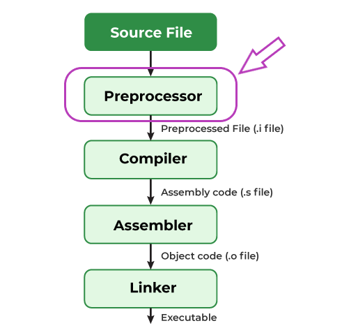

# C Macros
In this blog I will talk about macros in C. I will explain what they are, how to use them and why they are useful. Finally I will talk about some of the problems with macros and how to avoid them.

## What are macros?
Macro is a way to define constants in C. In the preprocessing phase, the preprocessor will replace all the macros with their values. It is a way to make the code more readable and maintainable. Long story short, preprocessor is a program that runs before the compiler and it is responsible for preprocess the source code before handing it to the compiler. Macro replacement is just one of the things that the preprocessor does. Here is a diagram that shows the compilation process in C:



If you want see the output of the preprocessor, you can use the -E flag like this:
```bash
gcc -E main.c
```
This will print the output of the preprocessor to the console. There are several things preprocessor will do such as include the header files, conditionally compile the code, and of course, macros replacement. But in this blog, we will only talk about macros replacement.

The reason you may want to use macros are:
1. To define constants
2. Increase readability
3. Compile time optimization
4. Implement something that is not in the language

## How to use macros?
We can use it to define constants like this:
```C
#include <stdio.h>

#define SIZE 5

int main() {
    printf("Hello, World!\n");
    for (int i = 0; i < SIZE; i++) {
        printf("i = %d\n", i);
    }
    return 0;
}
```
output:
```
Hello, World!
i = 0
i = 1
i = 2
i = 3
i = 4
```

We can even parametrize the macros like this:
```C
#include <stdio.h>

#define PRODUCT(X, Y) X * Y  

int main() {
    int a = 5;
    int b = 6;

    printf("PRODUCT(a, b) = %d\n", PRODUCT(a, b));
    return 0;
}
```
output:
```
PRODUCT(a, b) = 30
```

Notice we use capital letters for the macros. This is just a convention to make it easier to distinguish between macros and functions.

But be careful, macros are not functions. They are just text replacement. So if you do something like this:
```C
#include <stdio.h>

#define PRODUCT(X, Y) X * Y  

int main() {
    int a = 5;
    int b = 6;

    printf("PRODUCT(a, b) = %d\n", PRODUCT(a + 1, b));
    return 0;
}
```
you will get this

output:
```
PRODUCT(a + 1, b) = 11
```

This is because the preprocessor will replace the macros with their values. So the code above will be replaced with this:
```C
#include <stdio.h>

#define PRODUCT(X, Y) X * Y  

int main() {
    int a = 5;
    int b = 6;

    printf("PRODUCT(a, b) = %d\n", a + 1 * b);
    return 0;
}
```

To fix this, we need to add parentheses around the parameters like this:
```C
#include <stdio.h>

#define PRODUCT(X, Y) (X) * (Y)  

int main() {
    int a = 5;
    int b = 6;

    printf("PRODUCT(a, b) = %d\n", PRODUCT(a + 1, b));
    return 0;
}
```
output:
```
PRODUCT(a, b) = 36
```

Here is another example:
```C
#include <stdio.h>

#define PRINT_VAR(X) printf(#X " = %d at %p\n", X, &X)

int main() {
    int a = 5;
    PRINT_VAR(a);
    return 0;
}
```
output:
```
a = 5 at 0061FF1C
```

In C, we can do string concatenation like this:
```C
#include <stdio.h>

#define PRINT_VAR(X) printf(#X " = %d at %p\n", X, &X)

int main() {
    int a = 5;
    printf("a""b");
    return 0;
}
```
output:
```
ab
```

We can use # to capture the parameter as a string like this:
```C
#include <stdio.h>

#define PRINT_VAR(X) printf(#X " = %d at %p\n", X, &X)

int main() {
    int a = 5;
    PRINT_VAR(a);
    return 0;
}
```
output:
```
a = 5 at 0061FF1C
```

We can also use ## to concatenate two parameters like this:
```C
#include <stdio.h>

#define PRINT_VAR(X) printf(#X " = %d at %p\n", X, &X)
#define CONCAT(X, Y) X##Y

int main() {
    int a = 5;
    int ab = 6;
    PRINT_VAR(CONCAT(a, b));
    return 0;
}
```
output:
```
CONCAT(a, b) = 6 at 0061FF18
```

To make long macros more readable, we can use \ to continue the macro on the next line like this:
```C
#include <stdio.h>

#define PRINT_VAR(X) \
    printf(#X " = %d at %p\n", X, &X)

int main() {
    int a = 5;
    PRINT_VAR(a);
    return 0;
}
```
output:
```
a = 5 at 0061FF1C
```

## Predefined macros
There are some predefined macros that are defined by the compiler. For example,
```C
#include <stdio.h>

int main() {
    // prints the name of the file
    printf("File: %s\n", __FILE__);
    // prints the date this file was compiled
    printf("Date: %s\n", __DATE__);
    // prints the time this file was compiled
    printf("Time: %s\n", __TIME__);
    // prints the line number of this line
    printf("Line: %d\n", __LINE__);
    // prints the ANSI version of the compiler
    printf("ANSI: %d\n", __STDC__);
    // prints the STDC version of the compiler
    printf("STDC: %d\n", __STDC_HOSTED__);
    return 0;
}
```
output:
```
File: main.c
Date: Jan  2 2024
Time: 21:15:12
Line: 7
ANSI: 1
STDC: 1
```

we can use `__file__` and `__line__` to make a simple logging macro like this:
```C
#include <stdio.h>

#define LOG(X) \
    printf("File: %s, Line: %d, Message: %s\n", __FILE__, __LINE__, X)

int main() {
    LOG("Hello, World!");
    return 0;
}
```
output:
```
File: main.c, Line: 7, Message: Hello, World!
```


## Problems with macros and how to avoid them
Macros are not functions. They are just text replacement. So it does not have type checking and it does not have scope. When you hit an error, the debug message will not be very helpful. It will just tell you that there is an error in the macro. It will not tell you where the error is. So it is very hard to debug. It is also very hard to maintain. It is very easy to make mistakes. For example, if you forget to add parentheses around the parameters, you will get a wrong result. So you have to be very careful when using macros. You should only use it when you really need it. You should not use it just because you can. 

It is very fragile. It is very easy to break. It only works with code without side effects. For example:

```C
#include <stdio.h>
#include <stdlib.h>

#define MIN(X, Y) ((X) < (Y) ? (X) : (Y))

int get_next_number() {
    int number = rand() % 100;
    printf("Number: %d\n", number);
    return number;
}

int main() {
    int n1, n2, n3;
    n3 = MIN(n1 = get_next_number(), n2 = get_next_number());
    printf("Min: %d\n", n3);
    return 0;
}
```
output:
```
Number: 41
Number: 67
Number: 34
Min: 34
```
You would think that the minimum of 41 and 67 is 41. But it is not. It is 34. This is because the macro will replace the code with this:
```C
int main() {
    int n1, n2, n3;
    n3 = ((n1 = get_next_number()) < (n2 = get_next_number()) ? (n1 = get_next_number()) : (n2 = get_next_number()));
    printf("Min: %d\n", n3);
    return 0;
}
```
so after evaluating the first expression, the value of n1 will be regenerated again. In our case it was 34. You can see using macros can be very dangerous.

To fix the problem above we can do this
```C
#include <stdio.h>
#include <stdlib.h>

#define MIN(X, Y) ({     \
    typeof(X) x_ = (X);  \
    typeof(Y) y_ = (Y);  \
    (x_ < y_) ? x_ : y_; \
})

int get_next_number() {
    int number = rand() % 100;
    printf("Number: %d\n", number);
    return number;
}

int main() {
    int n1, n2, n3;
    n3 = MIN(n1 = get_next_number(), n2 = get_next_number());
    printf("Min: %d\n", n3);
    return 0;
}
```
output:
```
Number: 41
Number: 67
Min: 41
```
