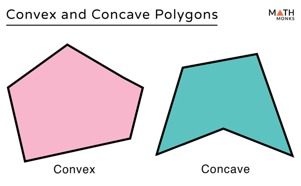
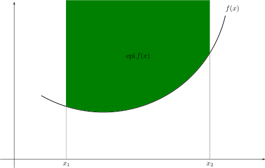

# Convex Functions
When I was studying how the proximal operator solver works, I came across the concept of a closed, proper, convex function which I am not familiar with. So I decided to write a blog about it to understand it better.

## Convex Function
### What is a Convex Shape?
So what is convex and its opposite, concave? I think the best way to understand these concepts is to look at a picture.

A more formal way of defining a convex shape could be that a shape is convex if for every pair of points inside the shape, the line segment connecting the two points is also inside the shape. A shape is concave if it is not convex.

### What is a Convex Set
In geometry, a subset of a Euclidean space, or more generally an affine space over the reals, is convex if, given 2 points in the subset, the line segment between the two points is also in the subset. Or equivalently, all the possible line that intersects the set will result in exactly **one** line segment (possibly empty) that is **entirely inside the set**.

### What is a Closed Set
A set is closed if it contains all its limit points. A limit point of a set is a point such that every neighborhood of the point contains at least one point of the set other than the point itself. In simpler terms, a set is closed if it contains all its boundary points. No matter how close you get to the boundary, you are still inside the set.

### What is a Convex Function
A convex function is a real-valued function defined on an interval with the property that its epigraph (the set of points on or above the graph of the function) is a **convex set**. 

#### Examples of Convex Functions
Here are some examples of convex functions:

1. **Linear Functions**: A function of the form $f(x) = ax + b$, where $a$ and $b$ are constants, is a convex function.

2. **Quadratic Functions**: A function of the form $f(x) = ax^2 + bx + c$, where $a$, $b$, and $c$ are constants and $a > 0$, is a convex function.

3. **Exponential Functions**: A function of the form $f(x) = e^{ax}$, where $a$ is a constant, is a convex function.

However, 

4. **Logarithmic Functions**: A function of the form $f(x) = \log(x)$, where $x > 0$, is a concave function.

### What is a Proper Convex Function
A convex function $f:X \rightarrow \mathbb{R} \cup \{+\infty\}$, where $X$ is a convex set, is called proper if it satisfies the following two conditions:

1. **The function never takes the value $-\infty$.** This condition ensures that the function has a lower bound, which is crucial for many optimization algorithms since it implies there is a "bottom" to the function that can potentially be found or approached.

2. **There exists at least one point in the domain of $f$ for which $f$ takes a finite value.** This ensures that the function is not trivially $+\infty$ everywhere, which means there is at least some part of its domain where the function is "meaningfully" defined and not just infinitely large.
   
The choice of the word "proper" to describe such functions is a bit of mathematical tradition, but it conveys the idea that the function is "appropriate" or "suitable" for further analysis and problem-solving. In optimization, especially, working with proper convex functions is essential because these functions have a well-defined behavior that allows for the application of various optimization techniques.

## A Closed, Proper, Convex Function
A function that is closed, proper, and convex is a function that is defined on a convex set and has the following properties:

1. **Convexity**: The function is convex, meaning that the epigraph of the function is a convex set.

2. **Properness**: The function is proper, meaning that it never takes the value $-\infty$ and there exists at least one point in the domain of the function for which the function takes a finite value.

3. **Closedness**: The function is closed, meaning that its epigraph is a closed set.

