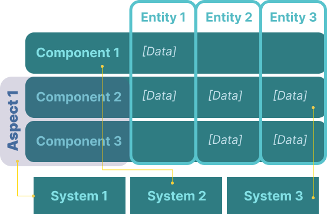
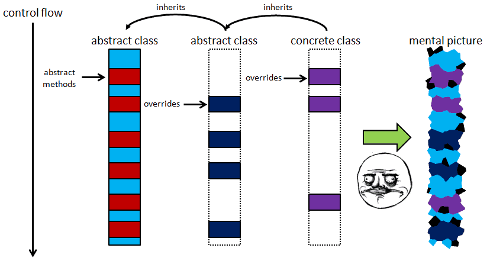

# Entity component system (ECS)
## what is Entity component system (ECS) ?
It is a software architecture pattern that is mostly used in game development. It is a way to organize your code in a way that is more performant than the traditional object oriented approach. It is also data oriented.

It follows the principle of composition over inheritance. It has three main parts:
- Entity
- Component
- System

### Entity
It is a unique identif. It can be anything, a number, a string, a GUID, etc. It is just a way to identify an object in the game.

### Component
It is a data structure that contains data and only data. It is a way to store data in a way that is easy to access and manipulate. Implementations typically use structs. It can be attached to an entity. 

### *Aspect
It is a way to group components together. Normaly one aspect of the game for example the physics aspect will contain all the components that are related to transform, velocity, etc.

### System
It is a process that acts on all entities with the desired components. For example, a render system will act on all entities that have a transform and mesh component. It will then render the mesh at the position of the transform.

### Their relationship
The entities are identifers that are used to group components together. The components are data structures that contain data. An aspect of the game can therefopre be seen as a collection of components which contains all the data that is needed for describing that aspect. The systems are processes that act on the entities that have the desired components.

## why is it good?
It is easier to maintain and extend because of its compositional nature. Not like the traditional object oriented approach where you have to inherit from a base class and override methods which results in very complex inheritance trees. 

On the other hand, the ECS uses composition which is much easier to maintain and understand. It also promotes modularity and reusability. It separates the data from the logic. It is also easier to extend. For example, if you want to add a new feature to the game, you can just add a new component and a new system that acts on that component. You do not have to modify the existing code. This makes it easier to maintain and extend.

Since it is data-oriented, it is also more performant. It is easier to optimize the code and make it run faster. It is also easier to parallelize the code and make it run on multiple threads. Data are commonly stored in arrays which are contiguous in physical memory. This makes it easier and faster to access and manipulate the data. It also makes it easier to cache the data and make it run faster.

## when to use ECS?
It is mostly used in game development. ECS is a big architectural pattern and it is not always necessary to use it. If you just have someting simple which does not have a lot of different things with data and not require a lot of performance, then you can just use the traditional object oriented approach. But if you want to make something that is more complex, for example, a big game and requires a lot of performance, then you should consider using ECS.
