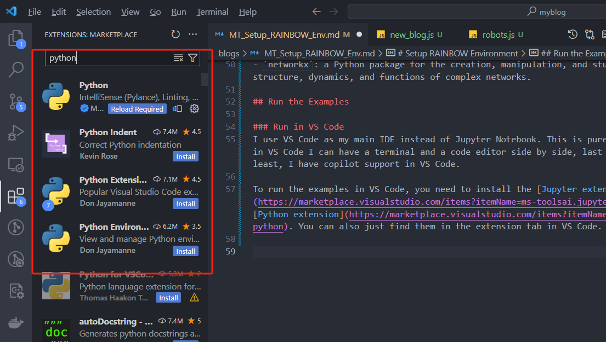
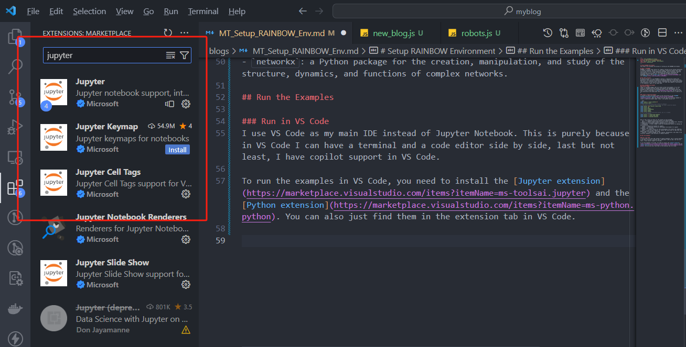
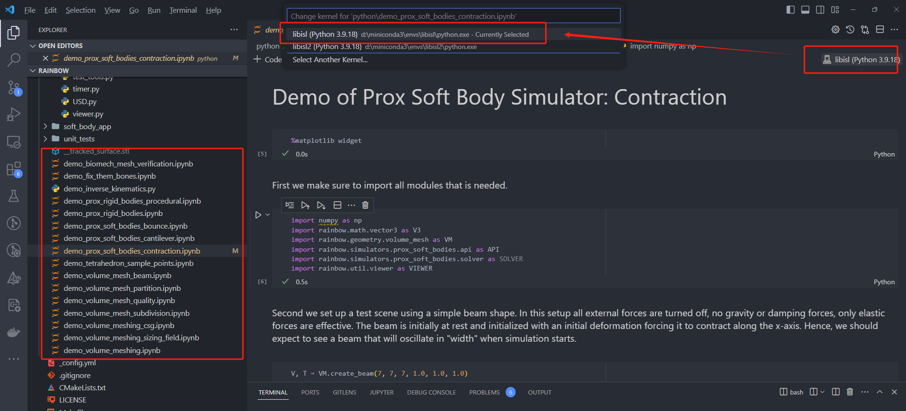

# Setup RAINBOW Environment
This blog I will document the process of setting up the RAINBOW environment. 

## What is RAINBOW?
RAINBOW is a python code library for rigging, setting up and running simulations in Jupyter notebooks. The aim is to have simple interactive python tools that can be used with very little backgorund knowledge, while providing a back-end functionality in C++ or CUDA for developing new simulator technology and providing high performance code. It is developed at DIKU University of Copenhagen. Here is the [github repo](https://github.com/diku-dk/RAINBOW) and its [homepage](https://diku-dk.github.io/RAINBOW/). 

## My Thesis Project
My thesis project is to use RAINBOW to develop a computational method that potentially could accurately simulate the physical behavior of the human colon. The focus is on creating a high-fidelity representation that captures the unique characteristics of the colon as a hollow, soft body tube capable of deformation in the abdominal region of the human body.

## Setup RAINBOW Environment
### Install Conda
Conda is a package manager that can create virtual environments. It is very useful for managing different python environments and dependencies. It is designed to make setting up and managing data science environments quick and easy. I wrote a blog about it [here](/blogs/How_to_Use_conda) and you can find the installation and usage guide there. My current conda version is conda 23.11.0.

### Create a Conda Environment
I created my conda environment based on the instructions on the [RAINBOW homepage installation guide](https://diku-dk.github.io/RAINBOW/installation_guide/). Open the command line and type the following command to create a conda environment named `libisl` with python version 3.9 

```bash
conda create -n libisl python=3.9
conda activate libisl
# conda 23.11.0 has conda-forge channel by default
# if you have an older version of conda, you need to add the channel
conda config --add channels conda-forge
conda install igl
conda install pyhull
conda install wildmeshing
conda install ipympl
conda install jupyter
# this is not in the installation guide, but it is needed
# to run the examples
conda install -c conda-forge meshplot
conda install -c conda-forge numba
conda install -c anaconda networkx
```

Here is the a quick run down for the purpose of each package:
- `igl`: a C++ geometry processing library with Python bindings.
- `pyhull`: a Python wrapper around the qhull library for convex hulls, Delaunay triangulations and Voronoi diagrams computations in n dimensions.
- `wildmeshing`: a Python wrapper around the wildmeshing library for meshing 2D and 3D domains.
- `ipympl`: a Matplotlib backend for Jupyter.
- `jupyter`: a web-based interactive development environment for Jupyter notebooks, code, and data.
- `meshplot`: a simple library for fast prototyping of 3D scenes and rendering.
- `numba`: a just-in-time compiler for Python that works best on code that uses NumPy arrays and functions, and loops.
- `networkx`: a Python package for the creation, manipulation, and study of the structure, dynamics, and functions of complex networks.

## Run the Examples

### Run in VS Code
I use VS Code as my main IDE instead of Jupyter Notebook. This is purely because in VS Code I can have a terminal and a code editor side by side, last but not least, I have copilot support in VS Code.

To run the examples in VS Code, you need to install the [Jupyter extension](https://marketplace.visualstudio.com/items?itemName=ms-toolsai.jupyter) and the [Python extension](https://marketplace.visualstudio.com/items?itemName=ms-python.python). You can also just find them in the extension tab in VS Code. 





After installing the extensions, you need to pick the right python interpreter. You can do this by clicking the python version in the top right corner of VS Code.



Then you can open the example file and run it.