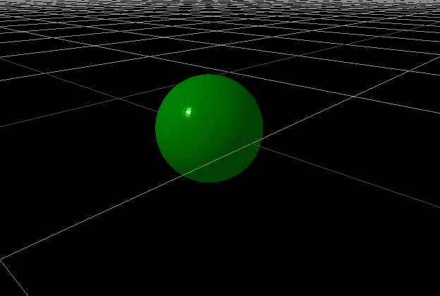
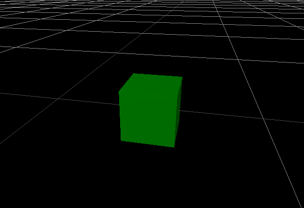
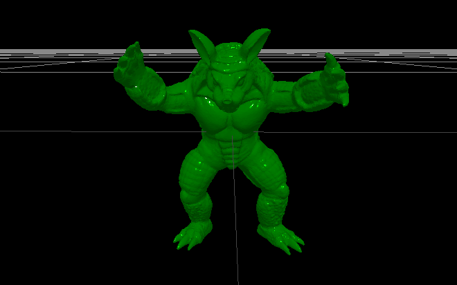

# Python Threejs Animation
In this blog I will use the [pythreejs](https://pythreejs.readthedocs.io/en/stable/index.html) library to create a 3D animation in a jupyter notebook.

## Installation
To setup the environment, I will use [conda](https://docs.conda.io/en/latest/). I wrote a [blog](/blogs/How_to_Use_conda) about conda and how to use it to setup a virtual environment.

The following command will create a conda environment named `pythreejs` with python version 3.9 and install the required packages.
```bash
conda create -n pythreejs python=3.9
conda activate pythreejs
conda install pythreejs
conda install jupyter
```

If you have problems with the installation, you can check out the [installation guide](https://pythreejs.readthedocs.io/en/stable/installing.html) on the pythreejs homepage.

In [this blog section](/blogs/MT_Setup_RAINBOW_Env#run-in-vs-code) I explain how to run a jupyter notebook in VS Code if you prefer that over the jupyter notebook app like me.

## Quick Introduction to pythreejs
The pythreejs library is a python wrapper for the [threejs](https://threejs.org/) library. It allows you to create 3D objects and scenes in a jupyter notebook.

### Main concepts
The main concepts of pythreejs are:
- **Scene**: The scene is the container for all objects. It is the root of the object tree.
- **Camera**: The camera defines the perspective of the scene. It defines the position and the direction of the view.
- **Renderer**: The renderer is responsible for rendering the scene. It is the link between the scene and the browser.
- **Object**: The object is the base class for all objects in the scene. It defines the position, rotation and scale of the object.
- **Geometry**: The geometry defines the shape of the object. It defines the vertices and faces of the object.
- **Material**: The material defines the appearance of the object. It defines the color, texture and lighting of the object.
- **Light**: The light defines the lighting of the scene. It defines the position and color of the light source.
- **Controls**: The controls define how the user can interact with the scene. It defines how the user can move the camera.
- **Animation**: The animation defines how the objects in the scene move. It defines the position, rotation and scale of the objects over time.

### Example
The following example contains all the main concepts of pythreejs mentioned above. 

First, we import the required packages.
```python
from pythreejs import *
import ipywidgets
from IPython.display import display
```

Then we create the camera.
```python
view_width = 600
view_height = 400

camera = PerspectiveCamera(position=[10, 10, 10], 
                           aspect=view_width/view_height)
```
The perspective camera is a camera that mimics the human eye.

Next, we create the light.
```python
point_light = PointLight(
    color='white', 
    position=[0, 10, 10], 
    intensity=1.0
)
ambient_light = AmbientLight()

light_helper = PointLightHelper(point_light)
grid_helper = GridHelper(200, 50)
```
We added the `light_helper` to make the light visible. The `grid_helper` is used to make the grid visible.

Then we create a sphere object.
```python
sphere = Mesh(
    geometry=SphereGeometry(
        radius=2,
        widthSegments=64,
        heightSegments=64,
    ),
    material=MeshLambertMaterial(
        color='green',
        roughness=0.1,
        flatShading=True,
        metalness=0.5,
    )
)
```
An object is a combination of a geometry and a material. The geometry defines the shape of the object and the material defines the appearance of the object.

Next, we create the scene.
```python
scene = Scene(
    children=[sphere, point_light, ambient_light, camera],
    background='black'
)
```
The scene is the container for all objects. It is the root of the object tree.

Then we create the controls.
```python
orbit = OrbitControls(controlling=camera)
```
The orbit controls define how the user can interact with the scene. It defines how the user can move the camera. You can:
- Rotate the camera by dragging the mouse while pressing the left mouse button.
- Pan the camera by dragging the mouse while pressing the right mouse button.
- Zoom the camera by scrolling the mouse wheel.

Finally, we create the renderer.
```python
renderer = Renderer(camera=camera, 
                    scene=scene, 
                    controls=[orbit], 
                    width=view_width, 
                    height=view_height
                    pixel_ratio=2.0)
```
The renderer is responsible for rendering the scene. It is the link between the scene and the browser.

Now we can display the renderer.
```python
display(renderer)
```

You should be able to see a green sphere in the middle of the screen like this:



You can interact with the scene using the orbit controls.

We can also use a cube instead of a sphere.
```python
cube = Mesh(
    geometry=BoxGeometry(
        width=2,
        height=2,
        depth=2,
    ),
    material=MeshLambertMaterial(
        color='green',
        roughness=0.1,
        flatShading=True,
        metalness=0.5,
    )
)
```
and 
```python
scene = Scene(
    children=[armadillo, point_light, ambient_light, camera, light_helper, grid_helper],
    background='black'
)
```



Now let's animate the cube. We will rotate the cube around the y-axis.
```python
spin_track = NumberKeyframeTrack(name='.rotation[y]', times=[0, 2], values=[0, 6.28])
spin_clip = AnimationClip(tracks=[spin_track])
spin_action = AnimationAction(AnimationMixer(cube), spin_clip, cube)
spin_action
```
`NumberKeyframeTrack` defines the property that we want to animate. In this case we want to animate the rotation around the y-axis. `times` defines the time points at which the values should be set. `values` defines the values at the time points. `AnimationClip` defines the animation. `AnimationAction` defines the action that should be performed. In this case we want to rotate the cube around the y-axis.


## Stretch Armadillo
In simulation projects, it is often useful to visualize the simulation. In this example, I will use pythreejs to visualize the stretch armadillo simulation. The geometry of the armadillo is changed over time. The armadillo is stretched in the x-direction.

### Load the Armadillo to the Scene
First, we load the armadillo from a file. For this we to use `igl` which is a python wrapper for the [libigl](https://libigl.github.io/libigl-python-bindings/) library. To install that library, we have to run the following command.
```bash
conda install igl
```

Then we can download the armadillo file from [here](/files/armadillo.obj) and load it.
```python
import igl

v, f = igl.read_triangle_mesh("armadillo.obj")
```
`v` contains the vertices of the armadillo and `f` contains the faces of the armadillo.

Next, we create the geometry and material of the armadillo.
```python
# convert v to 32 bit floats to avoid type errors later
v = v.astype('float32')
f = f.astype('uint32').ravel()

# create the geometry: the vertices and triangles
armadillo_geometry = BufferGeometry(
    attributes={
        "position": BufferAttribute(v, normalized=False),
        "index": BufferAttribute(f, normalized=False),
    }
)

armadillo_material = MeshStandardMaterial(
    color='green',
    roughness=0.1,
    flatShading=True,
    metalness=0.5,
)
```

Then we create the armadillo object.
```python
armadillo = Mesh(
    geometry=armadillo_geometry,
    material=armadillo_material,
)
```

And everything the same as in the example above.
```python
view_width = 600
view_height = 400

camera = PerspectiveCamera(position=[10, 10, 10], 
                           aspect=view_width/view_height)

point_light = PointLight(
    color='white', 
    position=[0, 10, 10], 
    intensity=1.0
)
ambient_light = AmbientLight()

light_helper = PointLightHelper(point_light)

scene = Scene(
    children=[armadillo, point_light, ambient_light, camera, light_helper, grid_helper],
    background='black'
)

orbit = OrbitControls(controlling=camera)

renderer = Renderer(camera=camera, 
                    scene=scene, 
                    controls=[orbit], 
                    width=view_width, 
                    height=view_height,
                    pixel_ratio=2.0)

display(renderer)
```



### Deform the Armadillo over Time
Now we want to deform the armadillo over time. We will stretch the armadillo in the x-direction. For this we will change the vertices of the armadillo over time.
