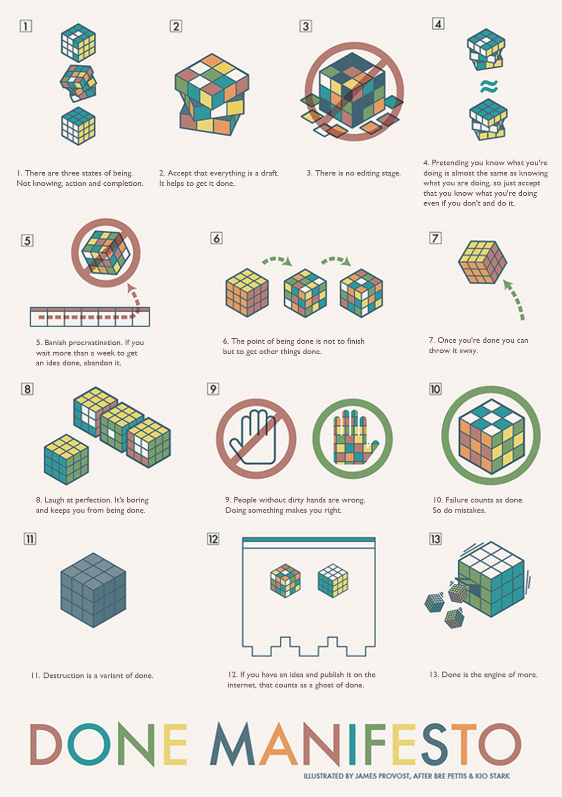

# The Cult of Done Manifesto
I came across this manifesto to day and a lot of it resonated with me. At the time I write this I have been procrastinating on writing a presentation for a while. I hope that by writing this I will be able to get back to work on it and hopefully become more productive in the future.

## The Cult of Done Manifesto
The manifesto was originally written by [Bre Pettis and Kio Stark in 2009](https://medium.com/@bre/the-cult-of-done-manifesto-724ca1c2ff13) within 20 minutes as they only had 20 minutes to spare. The process of writing it was also adhering to the manifesto which I found quite interesting.

### The Manifesto
1. There are three states of being. Not knowing, action and completion.
2. Accept that everything is a draft. It helps to get it done.
3. There is no editing stage.
4. Pretending you know what you’re doing is almost the same as knowing what you are doing, so just accept that you know what you’re doing even if you don’t and do it.
5. Banish procrastination. If you wait more than a week to get an idea done, abandon it.
6.The point of being done is not to finish but to get other things done.
7. Once you’re done you can throw it away.
8. Laugh at perfection. It’s boring and keeps you from being done.
9. People without dirty hands are wrong. Doing something makes you right.
10. Failure counts as done. So do mistakes.
11. Destruction is a variant of done.
12. If you have an idea and publish it on the internet, that counts as a ghost of done.
13. Done is the engine of more.

Here is a visual representation of the manifesto:

I learned the manifesto from [How To Get Started: The Cult of Done](https://www.youtube.com/watch?v=bJQj1uKtnus). There is exlpanation of each point in the video which I found quite helpful.