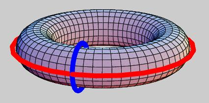

# Topology
Topology is a branch of mathematics that deals with the properties of space that are preserved under continuous transformations, such as stretching and bending, but not tearing or gluing. It emerged through the development of concepts from geometry and set theory, such as space, dimension, and transformation. Here are some of the concepts in topology that I find interesting.

> this blog is a summary of the video Topology, Manifolds & Differential Geometry by WHYB maths. You can watch the video [here](https://www.youtube.com/playlist?list=PLxBAVPVHJPcrNrcEBKbqC_ykiVqfxZgNl).

## What is a Topological Space?
A topological space is a set with topology.

For example:
1. a circle is a $S^1$ topological space
2. a sphere is a $S^2$ topological space
3. a torus (donut) is a $S^1 \times S^1$ or $T^2$ topological space

4. polyhedra are topological spaces

5. a Möbius strip is a topological space

6. a Klein bottle is a topological space

## What is a Topological Invariant?
To distinguish between different topological spaces, we use topological invariants. A topological invariant is a property of a topological space that is invariant under homeomorphisms. Homeomorphisms are continuous functions between topological spaces that have continuous inverses.

If we say two topological spaces are "the same" in terms of topology, we mean that we can smoothly deform one into the other without tearing or gluing.

For example, a cirle is the same as a square in terms of topology, because we can deform a square into a circle. 

the invariants of a topological space are:
1. the number of holes (genus)
2. dimension

so a circle is not homeomorphic to a sphere, because a circle is 1-dimensional, while a sphere is 2-dimensional. A torus is 2-dimensional and has 1 hole, so it is not homeomorphic to a sphere.

## Define a Topology

A topological space is a set. So how can we define let's say a circle as a set?

A common way to define a circle is to use the unit circle in the plane, which is the set of points $(x, y)$ such that $x^2 + y^2 = 1$. Or more formally:

$$S^1 = \{(x, y) \in \mathbb{R}^2 | x^2 + y^2 = 1\}$$

However, this definition is using a 2D plane space to define a 1D circle. Essentially, the circle is a subset of the plane. Can we define a circle without using a plane? First of all, a circle is a 1D object, so we should be able to define it using 1D space. A straightforward way to define a circle is to use the angular coordinate $\theta \in [0, 2\pi)$, which is a 1D space. Then a circle also means any point $\theta$ is equivalent to $\theta + 2\pi$. This is the definition of a circle as a set. So formally, a circle is defined as:

$$S^1 = \{\theta \in [0, 2\pi) | \theta \sim \theta + 2\pi\}$$

To define a 2D plane, we can use the Cartesian product of two 1D spaces. So a 2D plane is defined as:

$$\mathbb{R}^2 = \mathbb{R} \times \mathbb{R}$$

To define a square, we can use the Cartesian product of two intervals. So a square is defined as:

$$I^2 = I \times I$$

where $I = [0, 1]$.

Now, we can try to define a cylinder with a circle as its base. As we have discussed, topological spaces are sets with topology. So imagine we have two straight line sagement spaces, and we use Cartesian product to get the square space. Then we smoothly glue the two vertical sides of the square together, essentially replacing one vertical side with a circle. This is the definition of a cylinder as a set. So formally, a cylinder is defined as:

$$
C = I \times S^1
$$

And if we go further, we can replace the other vertical side with a circle, and we get a torus. So formally, a torus is defined as:

$$
T^2 = S^1 \times S^1
$$

## Manifolds

A manifold is a topological space that locally looks like Euclidean space. A manifold is a set with a topology and a smooth structure. A smooth structure is a collection of charts that cover the manifold and are compatible with each other. A chart is a homeomorphism from an open set in the manifold to an open set in Euclidean space. The compatibility condition is that the transition maps between overlapping charts are smooth.

