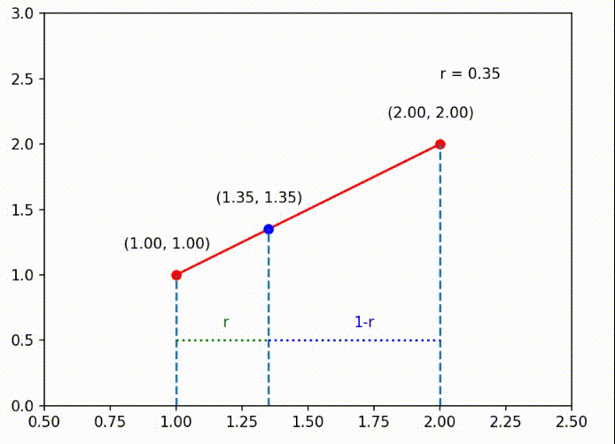
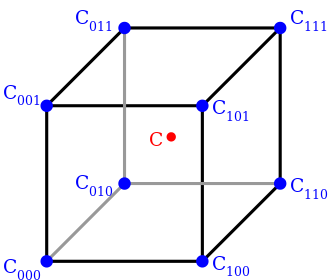
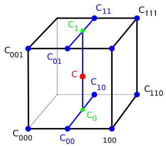
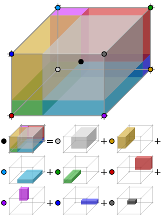

# Trilinear Interpolation
Trilinear interpolation is a method of multivariate interpolation on a 3-dimensional regular grid ([Wikipedia](https://en.wikipedia.org/wiki/Trilinear_interpolation)). It is an extension of linear interpolation for interpolating functions of 3 variables (x, y, z) on a 3D regular grid. The key idea is to perform linear interpolation first in one direction, and then again in the other two directions. The following image shows the idea of trilinear interpolation in 2D. The same idea can be extended to 3D.

## What is Linear Interpolation?
Linear interpolation is a method of guessing the value of a function $f(x)$ at a point $x$ given some function values $f(x_0)$ and $f(x_1)$ at two points $x_0$ and $x_1$. The following image shows the idea of linear interpolation in 2D. 



Here we have two points $P_0$ and $P_1$ with coordinates $(1, 1)$ and $(2, 2)$ respectively. We want to guess the value of $y$ at $x$ by linear interpolation. It is called linear interpolation because we are using a line to interpolate the value of $y$ at $x$. The line is defined by the two points $P_0$ and $P_1$ indicated in red. The first step is to find the ratio $r$ which is the distance in x-axis between $P_0$ and $x$ divided by the distance in x-axis between $P_0$ and $P_1$. Or in math notation:

$$
r = \frac{x - x_0}{x_1 - x_0}
$$

Then we can use this ratio as the weight to interpolate the value of $y$ at $x$. The following equation shows how to compute the value of $y$ at $x$.
$$
y = y_0 \cdot (1 - r) + y_1 \cdot r
$$
where $y_0$ and $y_1$ are the values of $y$ at $P_0$ and $P_1$ respectively.

This should be easy to understand. If $x$ is closer to $P_0$, then $r$ will be smaller therefore the weight of $y_0$ which is $(1 - r)$ will be closer to 1. This means that the value of $y$ at $x$ will be closer to $y_0$. On the other hand, if $x$ is closer to $P_1$, then $r$ will be larger therefore the weight of $y_1$ which is $r$ will be closer to 1. This means that the value of $y$ at $x$ will be closer to $y_1$.


Here is the Python Jupyter Notebook code that allows you to twick the value of $x$ and see how the value of $y$ changes.
```python
%matplotlib widget
from ipywidgets import *
import numpy as np
import matplotlib.pyplot as plt

fig = plt.figure()
p1 = (1, 1)
p2 = (2, 2)

# Plot the line
ax = fig.add_subplot(111)
ax.set_xlim(0, 3)
ax.set_ylim(0, 3)
ax.plot([p1[0], p2[0]], [p1[1], p2[1]], color='r')

@interact(x=FloatSlider(min=1, max=2, step=0.01, value=1.5))
def update(x):
    # clear the canvas
    ax.clear()

    ax.set_xlim(0.5, 2.5)
    ax.set_ylim(0, 3)
    ax.plot([p1[0], p2[0]], [p1[1], p2[1]], color='r')
    ax.plot([p1[0]], [p1[1]], 'ro')
    ax.plot([p2[0]], [p2[1]], 'ro')

    # interpolate the y value
    r = (x - p1[0]) / (p2[0] - p1[0])
    y = p1[1] * (1 - r) + p2[1] * r

    # plot the new point
    ax.plot([x], [y], 'bo')

    # draw vertical lines and show x coordinates
    for point in [p1, p2, (x, y)]:
        ax.vlines(point[0], 0, point[1], linestyles='dashed')
        ax.text(point[0]-0.2, point[1]+0.2, '({:.2f}, {:.2f})'.format(point[0], point[1]))

    # draw horizontal lines to indicate r and (1-r)
    ax.hlines(0.5, p1[0], x, colors='green', linestyles='dotted')  # Line for (1-r)
    ax.text(0.5 * (p1[0] + x), 0.6, 'r', color='green')
    ax.hlines(0.5, x, p2[0], colors='blue', linestyles='dotted')  # Line for r
    ax.text(0.5 * (x + p2[0]), 0.6, '1-r', color='blue')

    # show the ratio r on the top right corner
    ax.text(2, 2.5, 'r = {:.2f}'.format(r))

    fig.canvas.draw_idle()

plt.show()
```

## Steps
### Step 1. Find the 8 corners of the cube
The first step is to find the 8 corners of the cube. The following image shows the 8 corners of the cube. 




The corners are labeled with the index of the corner. $C_{000}$ and $C_{111}$ are the left bottom front and right top back corners respectively.

### Step 2. Find the 3 ratios
The next step is to find the 3 ratios $x_d$, $y_d$ and $z_d$ which are the distances ratio in x-axis, y-axis and z-axis between $C_{000}$ and $x$, $C_{000}$ and $y$, $C_{000}$ and $z$ respectively. 

$$
x_d = \frac{x - x_0}{x_1 - x_0}
$$

$$
y_d = \frac{y - y_0}{y_1 - y_0}
$$

$$
z_d = \frac{z - z_0}{z_1 - z_0}
$$

where $x_0$, $y_0$ and $z_0$ are the coordinates of $C_{000}$ and $x_1$, $y_1$ and $z_1$ are the coordinates of $C_{111}$.


### Step 3. Interpolate in x-axis
The next step is to linearly interpolate in x-axis. There are 4 edges in this cube that are parallel to the x-axis. They are:
- $C_{000}$ and $C_{100}$
- $C_{010}$ and $C_{110}$
- $C_{001}$ and $C_{101}$
- $C_{011}$ and $C_{111}$

Remember how 2D linear interpolation is just finding the point on the line defined by 2 points? The same idea can be applied here. We just need to project the point $x$ onto the edges parallel to the x-axis. Or you can image there is a plain perpendicular to the x-axis that contains the point needed to be interpolated. Then we just need to find the intersection of this plain and the edges parallel to the x-axis labeled as $C_{00}$, $C_{10}$, $C_{01}$ and $C_{11}$. We can compute the coordinates of the intersection points using the following equations:

$$
C_{00} = C_{000} \cdot (1 - x_d) + C_{100} \cdot x_d
$$

$$
C_{01} = C_{001} \cdot (1 - x_d) + C_{101} \cdot x_d
$$

$$
C_{10} = C_{010} \cdot (1 - x_d) + C_{110} \cdot x_d
$$

$$
C_{11} = C_{011} \cdot (1 - x_d) + C_{111} \cdot x_d
$$

### Step 4. Interpolate in y-axis
The next step is to linearly interpolate in y-axis but this time instead of using the edges on the cube, we use the points we just computed in the previous step. There are 2 edges defined by those four points that are parallel to the y-axis. They are:
- $C_{00}$ and $C_{10}$
- $C_{01}$ and $C_{11}$

We simply repeat the same process as in step 3.

$$
C_{0} = C_{00} \cdot (1 - y_d) + C_{10} \cdot y_d
$$

$$
C_{1} = C_{01} \cdot (1 - y_d) + C_{11} \cdot y_d
$$

### Step 5. Interpolate in z-axis
The last step is to linearly interpolate in z-axis. There is only one edge defined by the two points $C_0$ and $C_1$ and it is parallel to the z-axis. We simply repeat the same process one last time.

$$
C = C_{0} \cdot (1 - z_d) + C_{1} \cdot z_d
$$

And we are done! We have interpolated the value of $C$ at $x$, $y$ and $z$.

## The order of interpolation
The order of interpolation will not affect the result. We can interpolate in any order we want. For example, we can interpolate in y-axis first, then in x-axis and finally in z-axis.

## Geometry Visualization
Another intuitive way to understand trilinear interpolation is to visualize the geometry. The following image shows the geometry of trilinear interpolation.



We can still use the weighted sum idea from 2D linear interpolation. The only difference is that now we use the volume of the sub-cube instead of the length of the line segment to compute the weight.