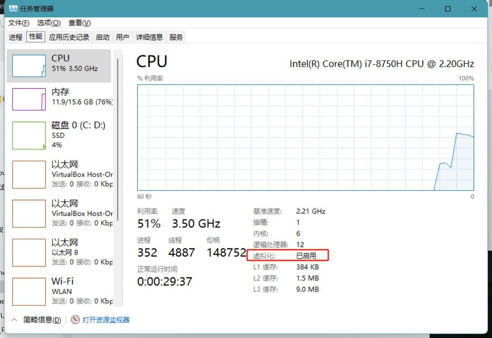

# Docker Desktop - Unexpected WSL error

This blog I will share my solution to solve the "Docker Desktop - Unexpected WSL error" on Windows 11.


## Step1 make sure you enable virtualization

In your windows search search bar type in "Windows feature"


make sure the virtualization platform and windows subsystem for Linux are on.


if they were on, try to turn them off, restart your computer, turn them on, and restart again. Before restart, make sure the CPU virtualization is enabled. You can find out in the task manager.



If they are not or you are not sure, try to go to bios to confirm. For me I use a ThinkPad it was f1 to interrupt to enter the bios. For other computer it maybe different. You should google it yourself for your specific computer.


make sure it says "enabled". 


## Step2 Install a distro on WSL

After restart your computer, pop up your PowerShell in admin mode.


use ` wsl -l -v` to see what distros are installed. If you don't have any that's find otherwise use `wsl --unregister <your distros>`  to remove them.

Then run

```cmd
wsl.exe --update
```

and

```cmd
wsl --set-default-version 2 
```


### Step3 Install a Linux distro on WSL

Docker needs a Linux OS core as backend so we need to install one.

You can check what distro is available by 
``` cmd
wsl --list --online
```

you can install one by

```cmd
wsl --install -d <Distro Name>
```

after you are done, run

```cmd
wsl -l -v
```

you should be able to see something like this

```cmd
 $> wsl -l -v
  NAME            STATE           VERSION
* <Distro Name>   Running         2
```

## Lastly, reinstall docker

Lastly, reinstall docker. You should go to setting > application  and search for docker and uninstall it. Then install it though the installer again.

After all this, if you are lucky you should see docker start up correctly.


## Still not working?

turn off Hyper-V to see if it works

```cmd 
bcdedit /set hypervisorlaunchtype off
```

and you can always turn it on by
```cmd
bcdedit /set hypervisorlaunchtype auto 
```

If you are windows pro you can also turn it off in the "windows features" which we mentioned previously.
