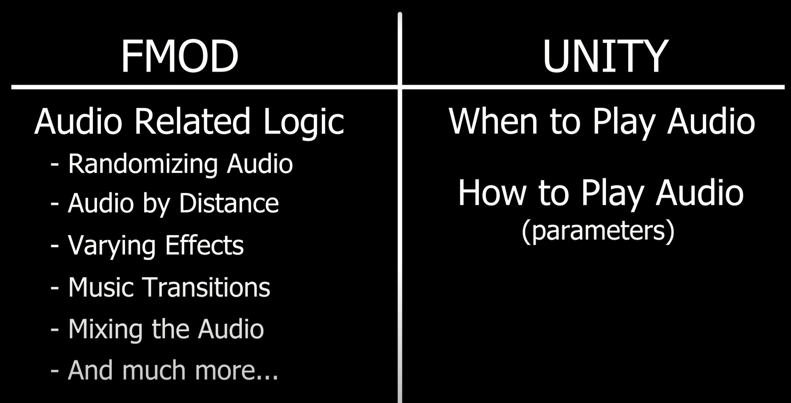

# Unity + Fmod

Notes from the video [How to make an Audio System in Unity | Unity + FMOD Tutorial - YouTube](https://www.youtube.com/watch?v=rcBHIOjZDpk).

Fmod in game is almost an industry standard for **adaptative audio**.

Fmod can be integrated into most game engines (e.g. Unity, Unread).

It is free to use for noncommercial or indie games. If the revenue exceed curtain amount there may be a free required.

## Terminology 

### Fmod Side

1. **Fmod Project** contains all the audio assets.

2. **(Audio) Asset** is the actual audio file (.wav, .ogg, etc..).

3. **Event** is a wrapper of one or a set of audio files and how they are configure to be played.

   - configuration contains: reverb effect, random frequency, etc..

   -  The event can be parameterized (for example: rain_intensity=0.2 or thunder_frequency=0.6). These  parameters can be changed.

4. **Bank** is a collection of a set of events with similar types. It also give control of which bank of events get loaded to the memory at any given time.

### Unity side

While directly reference the Fmod events and play them using C# script is possible, the references can be hard to manage after the project grows big. 

Instead we can use one or multiple singletons to manage the references.

we can also create a singleton `AudioManager` to manage everything related to Audio.

As for how the audio is played. For one-shot sounds, there is a method in the fmod library called `PlayOneShot(eventReference)` can do that.

For the looping sound we need to create a `Event Instance` which allows us to play pause audio .etc. However, it does require some setup and clean. Therefore, we put that logic in the audio manager so that it is handle by the audio manager.

When we want to do some actions, we use audio manager to do so.

For ambience and music they should also be managed and created in the audio manager as well. When the level starts, audio manager will start the event instance.

