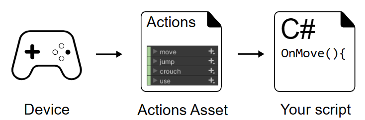

# Unity Input System
There are 4 types of workflow to use the new input system:
1. Direct
2. Embedded Actions
3. Actions Asset
4. PlayerInput Component

However, the first 2 are not very flexible, and the last one even though it requires the least amount of code, it is not very flexible either. Therefore, I will be using the Actions Asset workflow. The following figure shows the workflow of the Actions Asset workflow:



## Referencing the Actions Asset through a C# wrapper
To use your Actions Asset through a **C# wrapper**:

1. Select your Actions Asset in the project window
2. In the Inspector, enable **Generate C# Class** and select **Apply**. You should see a C# asset with the same name as your Actions Asset in your project window.
3. Create an instance of your Actions C# class in your script.
4. Access the Actions in your script by using the API of your Actions C# class.

For example:
```C#
using UnityEngine;
using UnityEngine.InputSystem;

public class DocsExampleActionsAssetCsWrapper : MonoBehaviour
{
    // this field will contain the actions wrapper instance
    ExampleActions actions;

    void Awake()
    {
        // instantiate the actions wrapper class
        actions = new ExampleActions();

        // for the "jump" action, we add a callback method for when it is performed
        actions.gameplay.jump.performed += OnJump;
    }

    void Update()
    {
        // our update loop polls the "move" action value each frame
        Vector2 moveVector = actions.gameplay.move.ReadValue<Vector2>();
    }

    private void OnJump(InputAction.CallbackContext context)
    {
        // this is the "jump" action callback method
        Debug.Log("Jump!");
    }

    void OnEnable()
    {
        actions.gameplay.Enable();
    }
    void OnDisable()
    {
        actions.gameplay.Disable();
    }
}
```
#### Referenece
[Unity Input System](https://docs.unity3d.com/Packages/com.unity.inputsystem@1.7/manual/Workflow-ActionsAsset.html)