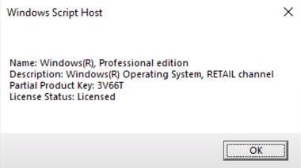

# Windows Keys
When you build your new PC, you need to install Windows. However, you need a Windows key to activate Windows. There are several ways to get a Windows key and there are different types of Windows keys. Here I will explain the different types of Windows keys and how to get them.

## Types of Windows Keys
There are 3 types of Windows keys:
- OEM key
- Retail key
- Volume License key

### OEM key
OEM stands for Original Equipment Manufacturer. OEM keys are sold by PC manufacturers like Dell, HP, Lenovo, etc. These keys are tied to the motherboard of the PC. So you cannot transfer these keys to another PC.

### Retail key
Retail keys are sold by Microsoft or authorized retailers. These keys can be transferred to another PC. However, you can only use these keys on one PC at a time.

### Volume License key
Volume License keys are sold to organizations. These keys can be transferred to another PC.

## How to see what type of Windows key you have?
You can use the following command to see what type of Windows key you have.
```bash
slmgr /dli
```

If you have a retail key, you will see this:



If you forgot your product key, you can use the following command to see your product key:
```bash
wmic path softwareLicensingService get OA3xOriginalProductKey
```

Then if you need to deactivate your key, you can use the following command:
```bash
slmgr /upk
```
and clear the product key from the registry by using the following command:
```bash
slmgr /cpky
```

If you want to activate your key, you can use the following command:
```bash
slmgr /ipk <your key>
```
or you can simply use the windows settings GUI to activate your key.

## OEM key vs Retail key
OEM keys are cheaper than retail keys. However, OEM keys are tied to the motherboard of the PC. So you cannot transfer these keys to another PC. Retail keys are more expensive than OEM keys. However, you can transfer these keys to another PC. So if you are building your own PC, you should buy a retail key. If you are buying a pre-built PC, you should buy an OEM key. This [video](https://www.youtube.com/watch?v=UZcuRiZIIRY) explains the difference between OEM keys and retail keys. Essentially, OEM keys are for pre-built PCs and retail keys are for self-built PCs and the price for retail keys is about 12 times the price for OEM keys (according to the video).

